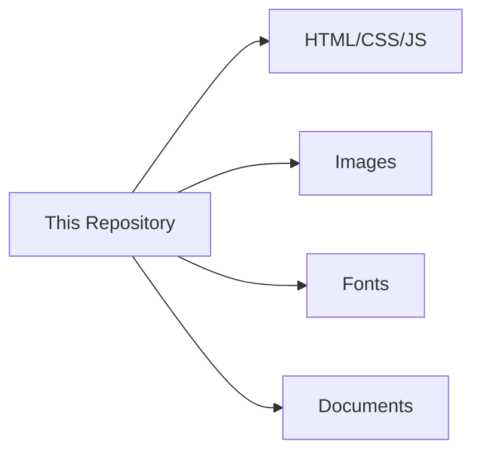

# 🌟 Personal Website Static Hosting

Welcome to my personal website's static resource hub! 🏠 This repository serves as the home for all the static assets powering my personal corner of the internet.



## 🛠️ Tech Stack

<div style="display: flex; flex-wrap: wrap; gap: 10px; margin: 20px 0;">     </div>

## 📂 Project Structure

```
.
|—— web_images
|	|—— iTab
|	|—— WordPress
├── assets/            # All static resources
│   ├── css/           # Stylesheets
│   ├── js/            # JavaScript files
│   ├── images/        # Images and icons
├── index.html         # Main entry point
├── CNAME              # Custom domain config
└── README.md          # This file
```

## 🚀 Deployment

This site is automatically deployed via GitHub Pages 🌍. Every push to the `main` branch triggers a new deployment.

[](https://your-username.github.io/)

## 🎨 Design Philosophy

- **Lightning Fast** ⚡ - Optimized static assets for instant loading
- **Mobile First** 📱 - Responsive design that works everywhere
- **Accessible** ♿ - Built with WCAG guidelines in mind
- **Minimalist** ✨ - Clean, distraction-free experience

## 📊 Performance Metrics

| Metric         | Score |
| :------------- | :---- |
| Lighthouse     | 🟢 98  |
| PageSpeed      | 🟢 97  |
| Accessibility  | 🟢 100 |
| Best Practices | 🟢 100 |

## 📜 License

This project is licensed under the MIT License - see the [LICENSE](https://license/) file for details.

------

<p align="center"> Made with ❤️ and ☕ by WhisperYao </p>